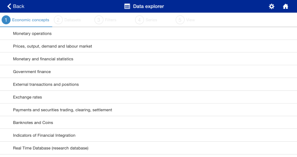
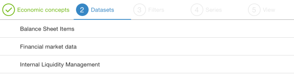
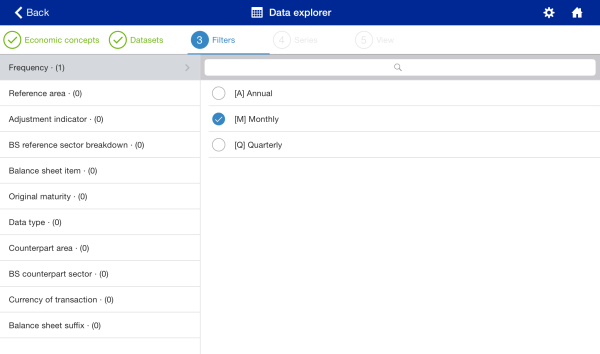
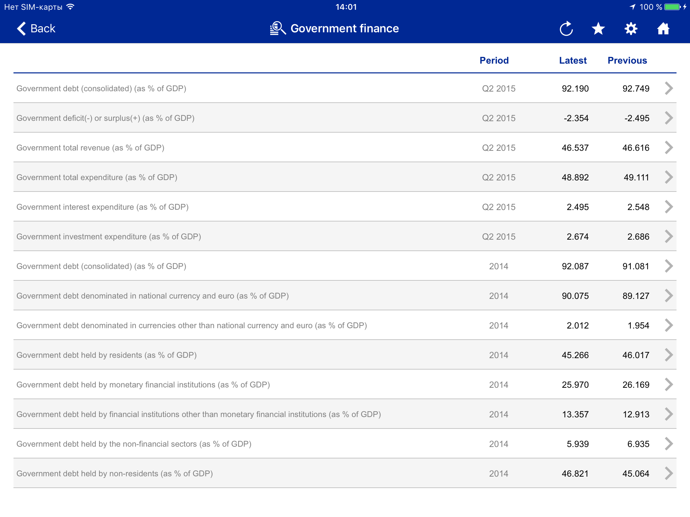

# Requirements: Browse by topic

## Summary

Browsing a list of *topics* (i.e. statistical domains) is a common way for users to find the data they want in a data source. This section documents the SDMX artefacts needed to support this use case with SDMX-JSON, as well as the steps involved.

## Artefacts involved

The following SDMX artefacts are needed to support this use case:
- Category Scheme
- Categorisation
- Dataflow
- Content Constraint
- Data Structure Definition
- Concept
- Codelist

For additional information about these artefacts, please refer to the [SDMX information model](http://sdmx.org/wp-content/uploads/2011/08/SDMX_2-1-1_SECTION_2_InformationModel_201108.pdf).

For additional information about the query syntax used in the examples below, please refer to the [SDMX RESTful specification](https://github.com/sdmx-twg/sdmx-rest/tree/master/v2_1/ws/rest/docs).

## Choreography

### Step 1: Get the list of statistical domains

The starting point is to retrieve the list of *topics* for which data are available. These are known as `category schemes` in SDMX. They can be retrieved using a categoryscheme query:

```
https://ws-entry-point/categoryscheme
```

Alternatively, if only the topics of a particular category scheme are needed, it is possible to only retrieve that particular category scheme:

```
https://ws-entry-point/categoryscheme/agency-id/category-scheme-id
```

The response will contain the `category scheme(s)` and its `categories`.

The screenshot below shows an example of the type of user interface (a treeview control in this case) that can be built from a category scheme, using the [ECB Statistical Data Warehouse](https://sdw.ecb.europa.eu) as an example.


The screenshot below displays the category scheme as a list box, similar to the typical control displayed by mobile apps. The example is taken from the ECB statistical tablet app.



The client typically needs to display the names of the categories. In addition, some clients might also want to display the descriptions of the categories and the name of the category schemes.

In addition, on order to perform the next query (cf. step 2 below), clients will need the full references for the categories (id) and category schemes (id, agency id and version).

### Step 2: Get the list of dataflows attached to the selected domains

Once a user has selected a category, the web service client will need to retrieve the *baskets of data* attached to the category. These are known as `dataflows` in SDMX. It is possibe to retrieve these, using a category query and resolving its references.

```
https://ws-entry-point/categoryscheme/agency-id/category-scheme-id/category-scheme-version/category-id?references=parentsandsiblings
```

The response will contain the selected `category`, the `categorisations` that link dataflows to the category (the *parents*) and the `dataflows` referenced by the categorisations (the *siblings*).

The screenshot below shows an example of the type of user interface (a list box in this case) that can be built from the response. The example is taken from the ECB statistical tablet app.



The client typically needs to display the names of the dataflows. In addition, some clients might also want to display the descriptions of the dataflows and the name of the selected category.

In addition, in order to perform the next query (cf. step 3 below), clients will need the full references to the dataflows (id, agency id and version).

### Step 3: Find data in the selected dataflow, using concept filters

Once a user has selected a dataflow, the web service client will need to retrieve the `concepts` that are used to structure that dataflow. In addition, the list of allowed values for each of these concepts will be needed. The list of values for which data exist can be found in the `content constraints`, while the names of the values can be retrieved from the `codes` in the `codelists` referenced by the `data structure definition`. All these artefacts can be retrieved in just one dataflow query, again using the references' resolution mechanism offered by the SDMX RESTful API.

```
https://ws-entry-point/dataflow/agency-id/dataflow-id/dataflow-version?references=all
```

The response will contain the selected `dataflow`, the `data structure definition` that structure the data for the dataflow, as well as the `concepts` and `codelists` referenced by the data structure definition. In addition, it will contain the `content constraints` attached to the dataflow.

The screenshot below shows an example of the type of user interface (a list box for the list of concepts, and a collection of check boxes for the list of allowed values for each of the concepts in this example) that can be built from the response. The example is taken from the ECB statistical tablet app.



The client typically needs to display the name of the concepts (Frequency, Reference area, etc.) and of the allowed values for each concept (e.g.: Annual, Monthly, etc.). In addition, some clients might also want to display the descriptions of the concepts and codes, as well as the code ids.

In order to retrieve the data matching the user's filters, the web service clients will need the full references to the dataflow (id, agency id and version) and the code ids for the dimension values.

Once the filters' selection is finished, the client will typically provide a list of matching series like the one shown on the screen below, but this is typically the result of a data query:


